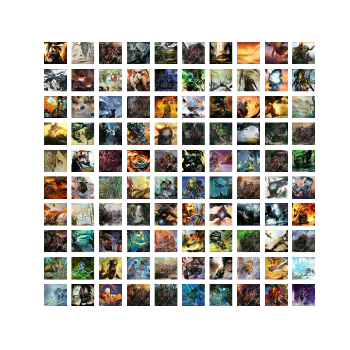

# Deep Convolutional Generative Adversarial Network
## Authors 

- Julian DUPUIS

## Hyperparameters

- image size = 56
- latent size = 100
- gen channels = 64
- dis channels = 64
- batch size = 100
- learning rate = 0.0002

## Results

After 101 epochs, here are the results obtains on the same vector of values :

One random vector on trained data :

## Dataset

[Dataset link on kaggle](www.kaggle.com/dataset/5807af0fb625318fa859b01fa4303595bb72b934ef4e24128dacd2f6d9f41aea)
